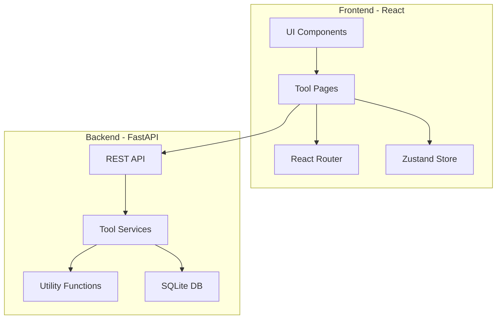

# z1x - All-in-One Utility Tool

## Overview
z1x is a comprehensive utility suite built with Python (FastAPI) backend and React frontend, offering 50+ tools across 5 major categories.

---

## Tech Stack

### Backend
- **Framework**: FastAPI (Python 3.11+)
- **Database**: SQLite (for user preferences/history)
- **Libraries**: 
  - Pillow (image processing)
  - cryptography (encryption)
  - python-qrcode (QR codes)
  - pandas (data manipulation)
  - pydantic (validation)

### Frontend
- **Framework**: React 18 + TypeScript
- **Styling**: Tailwind CSS
- **State Management**: Zustand
- **Routing**: React Router v6
- **UI Components**: Radix UI primitives
- **Icons**: Lucide React

---

## Feature Categories

### 1. Developer Tools
| Tool | Description |
|------|-------------|
| JSON Formatter | Pretty print, minify, validate JSON |
| YAML/JSON Converter | Convert between YAML and JSON |
| Base64 Encoder/Decoder | Encode/decode Base64 strings |
| URL Encoder/Decoder | Encode/decode URLs |
| Regex Tester | Test regex patterns with live preview |
| UUID Generator | Generate UUIDs v1, v4, v5 |
| Lorem Ipsum Generator | Generate placeholder text |
| Diff Checker | Compare two texts side-by-side |
| Code Beautifier | Format HTML, CSS, JS, Python |
| JWT Decoder | Decode and inspect JWT tokens |
| Cron Expression Parser | Parse and explain cron expressions |
| Unix Timestamp Converter | Convert timestamps to dates |

### 2. Productivity Tools
| Tool | Description |
|------|-------------|
| Pomodoro Timer | Focus timer with breaks |
| Note Pad | Quick notes with auto-save |
| Todo List | Simple task manager |
| Word Counter | Count words, characters, sentences |
| Text Case Converter | uppercase, lowercase, title, sentence |
| Markdown Preview | Live markdown to HTML preview |
| Meeting Cost Calculator | Calculate meeting costs by attendees |
| Reading Time Estimator | Estimate reading time for text |
| Stopwatch | Simple stopwatch with laps |
| Countdown Timer | Set countdown timers |

### 3. Data Tools
| Tool | Description |
|------|-------------|
| CSV to JSON | Convert CSV to JSON |
| JSON to CSV | Convert JSON to CSV |
| SQL Formatter | Format SQL queries |
| Data Generator | Generate fake data for testing |
| Number Base Converter | Binary, Octal, Decimal, Hex |
| Unit Converter | Length, weight, temperature, etc. |
| Percentage Calculator | Various percentage calculations |
| Statistics Calculator | Mean, median, mode, std dev |
| File Size Converter | Convert between KB, MB, GB |
| Epoch Converter | Unix epoch to human readable |

### 4. Security Tools
| Tool | Description |
|------|-------------|
| Password Generator | Generate secure passwords |
| Password Strength Checker | Check password strength |
| Hash Generator | MD5, SHA-1, SHA-256, SHA-512 |
| Hash Verifier | Verify hash matches |
| UUID Validator | Validate UUID format |
| Credit Card Validator | Luhn algorithm validator |
| Email Validator | Validate email format |
| IP Address Lookup | Get info about IP addresses |
| Random Number Generator | Cryptographically secure random |
| Checksum Calculator | Calculate file checksums |

### 5. Media Tools
| Tool | Description |
|------|-------------|
| QR Code Generator | Generate QR codes |
| QR Code Reader | Read QR codes from images |
| Color Picker | Pick and convert colors |
| Color Palette Generator | Generate color palettes |
| Image to Base64 | Convert images to Base64 |
| Favicon Generator | Create favicons from images |
| SVG to PNG Converter | Convert SVG to PNG |
| Image Compressor | Compress images losslessly |
| Placeholder Image Generator | Generate placeholder images |
| Gradient Generator | Create CSS gradients |

---

## Architecture



---

## API Structure

### Base URL: `/api/v1`

```
/api/v1/
├── /developer/
│   ├── POST /json/format
│   ├── POST /json/validate
│   ├── POST /yaml-to-json
│   ├── POST /json-to-yaml
│   ├── POST /base64/encode
│   ├── POST /base64/decode
│   ├── POST /url/encode
│   ├── POST /url/decode
│   ├── POST /regex/test
│   ├── GET  /uuid/generate
│   ├── POST /diff
│   └── POST /beautify
│
├── /security/
│   ├── GET  /password/generate
│   ├── POST /password/strength
│   ├── POST /hash/generate
│   ├── POST /hash/verify
│   └── POST /validate/email
│
├── /data/
│   ├── POST /csv-to-json
│   ├── POST /json-to-csv
│   ├── POST /sql/format
│   ├── GET  /fake-data
│   └── POST /convert/base
│
├── /media/
│   ├── POST /qr/generate
│   ├── POST /qr/read
│   ├── POST /image/compress
│   ├── POST /image/to-base64
│   └── POST /color/palette
│
└── /productivity/
    ├── POST /text/word-count
    ├── POST /text/case-convert
    └── POST /markdown/render
```

---

## Project Structure

```
z1x/
├── backend/
│   ├── app/
│   │   ├── __init__.py
│   │   ├── main.py
│   │   ├── config.py
│   │   ├── api/
│   │   │   ├── __init__.py
│   │   │   ├── router.py
│   │   │   ├── developer.py
│   │   │   ├── security.py
│   │   │   ├── data.py
│   │   │   ├── media.py
│   │   │   └── productivity.py
│   │   ├── services/
│   │   │   ├── __init__.py
│   │   │   ├── json_service.py
│   │   │   ├── hash_service.py
│   │   │   ├── password_service.py
│   │   │   ├── qr_service.py
│   │   │   └── image_service.py
│   │   ├── models/
│   │   │   ├── __init__.py
│   │   │   └── schemas.py
│   │   └── utils/
│   │       ├── __init__.py
│   │       └── helpers.py
│   ├── requirements.txt
│   └── Dockerfile
│
├── frontend/
│   ├── src/
│   │   ├── App.tsx
│   │   ├── main.tsx
│   │   ├── index.css
│   │   ├── components/
│   │   │   ├── Layout/
│   │   │   │   ├── Sidebar.tsx
│   │   │   │   ├── Header.tsx
│   │   │   │   └── Footer.tsx
│   │   │   ├── ui/
│   │   │   │   ├── Button.tsx
│   │   │   │   ├── Input.tsx
│   │   │   │   ├── Card.tsx
│   │   │   │   └── ...
│   │   │   └── tools/
│   │   │       ├── JsonFormatter.tsx
│   │   │       ├── PasswordGenerator.tsx
│   │   │       └── ...
│   │   ├── pages/
│   │   │   ├── Home.tsx
│   │   │   ├── DeveloperTools.tsx
│   │   │   ├── SecurityTools.tsx
│   │   │   ├── DataTools.tsx
│   │   │   ├── MediaTools.tsx
│   │   │   └── ProductivityTools.tsx
│   │   ├── hooks/
│   │   │   ├── useApi.ts
│   │   │   └── useLocalStorage.ts
│   │   ├── store/
│   │   │   └── index.ts
│   │   ├── lib/
│   │   │   ├── api.ts
│   │   │   └── utils.ts
│   │   └── types/
│   │       └── index.ts
│   ├── package.json
│   ├── tailwind.config.js
│   ├── tsconfig.json
│   ├── vite.config.ts
│   └── Dockerfile
│
├── docker-compose.yml
└── README.md
```

---

## UI Design Concept

### Design Philosophy
**Plain, functional, developer-friendly** - Inspired by tools like Linear, Raycast, and Vercel. No gradients, no glow effects, no unnecessary animations. Just clean typography and purposeful spacing.

### Design Principles
1. **Whitespace is a feature** - Generous padding, breathing room
2. **Typography-first** - Good fonts do the heavy lifting
3. **Subtle borders** - Thin 1px borders, not shadows everywhere
4. **Monospace for data** - Code and data in monospace fonts
5. **No decorative elements** - Every element serves a purpose

### Layout
- **Top Navigation**: Simple horizontal nav with category tabs
- **Main Area**: Single-column tool interface, centered
- **No sidebar clutter**: Clean, focused workspace

### Typography
```css
/* Fonts */
--font-sans: Inter, system-ui, sans-serif;
--font-mono: JetBrains Mono, Fira Code, monospace;

/* Sizes */
--text-xs: 0.75rem;
--text-sm: 0.875rem;
--text-base: 1rem;
--text-lg: 1.125rem;
--text-xl: 1.25rem;
--text-2xl: 1.5rem;
```

### Color Palette - Minimal
```css
/* Light Theme - Default */
--bg: #ffffff;
--bg-secondary: #fafafa;
--border: #e5e5e5;
--text: #171717;
--text-muted: #737373;
--accent: #171717;  /* Black accent - simple */
--accent-text: #ffffff;

/* Dark Theme */
--bg: #0a0a0a;
--bg-secondary: #141414;
--border: #262626;
--text: #fafafa;
--text-muted: #a3a3a3;
--accent: #fafafa;  /* White accent - simple */
--accent-text: #0a0a0a;
```

### Component Style Guide

**Buttons**
- Primary: Black bg, white text, no border-radius or minimal 4px
- Secondary: Transparent bg, thin border, dark text
- Ghost: No bg, no border, just text

**Inputs**
- Simple bordered box, no shadows
- Focus: darker border only
- Placeholder: muted gray text

**Cards**
- White bg, 1px border, no shadow
- Or: subtle bg color difference, no border

### What We Are NOT Doing
- ❌ Gradient backgrounds
- ❌ Glowing effects or neon colors
- ❌ Rounded corners everywhere - pills
- ❌ Drop shadows on everything
- ❌ Animated backgrounds
- ❌ 3D elements or illustrations
- ❌ Overly colorful accent palettes

### What We ARE Doing
- ✅ Black and white with purpose
- ✅ Clean monospaced code displays
- ✅ Thin borders, subtle separators
- ✅ Generous whitespace
- ✅ Fast, instant interactions
- ✅ Clear hierarchy with typography

### Responsive Design
- Desktop: Centered content, max-width 900px
- Tablet: Same layout, slightly less padding
- Mobile: Full-width, stacked elements

---

## Key Features

### 1. Offline-First
- Many tools work entirely in the browser
- Service worker for offline access
- Local storage for preferences

### 2. History & Favorites
- Recent tool usage history
- Favorite tools quick access
- Saved outputs

### 3. Keyboard Shortcuts
- `Ctrl/Cmd + K` - Command palette
- `Ctrl/Cmd + Enter` - Execute tool
- `Ctrl/Cmd + S` - Save output

### 4. Copy & Share
- One-click copy to clipboard
- Share results via URL
- Export outputs

---

## Implementation Priority

### Phase 1 - Core Setup
- Project scaffolding
- Basic layout and routing
- API infrastructure

### Phase 2 - Developer Tools
- JSON Formatter
- Base64 Encoder/Decoder
- Regex Tester
- UUID Generator

### Phase 3 - Security Tools
- Password Generator
- Hash Generator
- Password Strength Checker

### Phase 4 - Data Tools
- CSV/JSON Converters
- Unit Converter
- Number Base Converter

### Phase 5 - Media Tools
- QR Code Generator
- Color Picker
- Image Compressor

### Phase 6 - Productivity Tools
- Pomodoro Timer
- Note Pad
- Word Counter

### Phase 7 - Polish
- Dark/Light theme
- Keyboard shortcuts
- PWA support
- Documentation

---

## Wireframe - Clean Layout

```
┌─────────────────────────────────────────────────────────────────┐
│                                                                 │
│   z1x          Dev  Data  Security  Media  Time           ◐    │
│   ─────────────────────────────────────────────────────────    │
│                                                                 │
└─────────────────────────────────────────────────────────────────┘

┌─────────────────────────────────────────────────────────────────┐
│                                                                 │
│                                                                 │
│                      JSON Formatter                             │
│                      Format and validate JSON data              │
│                                                                 │
│                                                                 │
│   ┌─────────────────────────────────────────────────────────┐   │
│   │                                                         │   │
│   │  Paste your JSON here...                                │   │
│   │                                                         │   │
│   │                                                         │   │
│   │                                                         │   │
│   │                                                         │   │
│   └─────────────────────────────────────────────────────────┘   │
│                                                                 │
│                                                                 │
│   Indent   [2]       [ ] Sort keys                              │
│                                                                 │
│                                                                 │
│   [Format]     [Minify]     [Copy]                              │
│                                                                 │
│                                                                 │
│   Output                                                        │
│   ┌─────────────────────────────────────────────────────────┐   │
│   │                                                         │   │
│   │  {                                                      │   │
│   │    "result": "formatted"                                │   │
│   │  }                                                      │   │
│   │                                                         │   │
│   └─────────────────────────────────────────────────────────┘   │
│                                                                 │
│                                                                 │
└─────────────────────────────────────────────────────────────────┘
```

### Design Notes
- Top nav only, no sidebar - clean and focused
- Centered content with max-width constraint
- Monospace font for input/output areas
- Simple black buttons, no colors
- Generous vertical spacing between sections
- Dark mode toggle in header - half circle icon

---

## Next Steps

1. Set up project structure with backend/ and frontend/ directories
2. Initialize FastAPI backend with base routes
3. Initialize Vite + React + TypeScript frontend
4. Implement clean navigation and layout
5. Build tools incrementally starting with JSON Formatter
6. Add dark/light theme toggle
