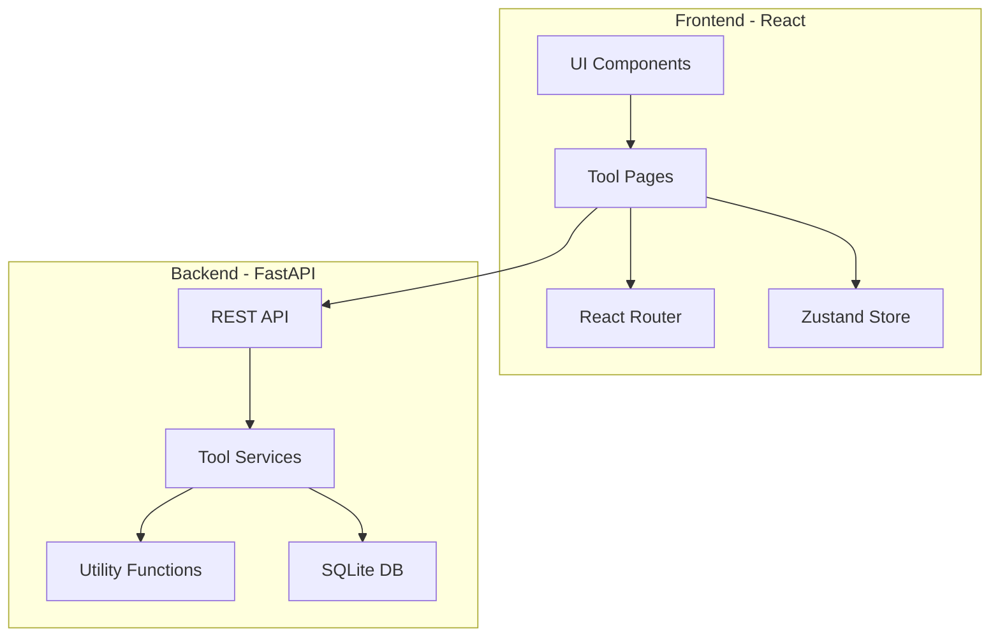

# z1x - All-in-One Utility Tool

## Overview
z1x is a comprehensive utility suite built with Python (FastAPI) backend and React frontend, offering 50+ tools across 5 major categories.

---

## Tech Stack

### Backend
- **Framework**: FastAPI (Python 3.11+)
- **Database**: SQLite (for user preferences/history)
- **Libraries**: 
  - Pillow (image processing)
  - cryptography (encryption)
  - python-qrcode (QR codes)
  - pandas (data manipulation)
  - pydantic (validation)

### Frontend
- **Framework**: React 18 + TypeScript
- **Styling**: Tailwind CSS
- **State Management**: Zustand
- **Routing**: React Router v6
- **UI Components**: Radix UI primitives
- **Icons**: Lucide React

---

## Feature Categories

### 1. Developer Tools
| Tool | Description |
|------|-------------|
| JSON Formatter | Pretty print, minify, validate JSON |
| YAML/JSON Converter | Convert between YAML and JSON |
| Base64 Encoder/Decoder | Encode/decode Base64 strings |
| URL Encoder/Decoder | Encode/decode URLs |
| Regex Tester | Test regex patterns with live preview |
| UUID Generator | Generate UUIDs v1, v4, v5 |
| Lorem Ipsum Generator | Generate placeholder text |
| Diff Checker | Compare two texts side-by-side |
| Code Beautifier | Format HTML, CSS, JS, Python |
| JWT Decoder | Decode and inspect JWT tokens |
| Cron Expression Parser | Parse and explain cron expressions |
| Unix Timestamp Converter | Convert timestamps to dates |

### 2. Productivity Tools
| Tool | Description |
|------|-------------|
| Pomodoro Timer | Focus timer with breaks |
| Note Pad | Quick notes with auto-save |
| Todo List | Simple task manager |
| Word Counter | Count words, characters, sentences |
| Text Case Converter | uppercase, lowercase, title, sentence |
| Markdown Preview | Live markdown to HTML preview |
| Meeting Cost Calculator | Calculate meeting costs by attendees |
| Reading Time Estimator | Estimate reading time for text |
| Stopwatch | Simple stopwatch with laps |
| Countdown Timer | Set countdown timers |

### 3. Data Tools
| Tool | Description |
|------|-------------|
| CSV to JSON | Convert CSV to JSON |
| JSON to CSV | Convert JSON to CSV |
| SQL Formatter | Format SQL queries |
| Data Generator | Generate fake data for testing |
| Number Base Converter | Binary, Octal, Decimal, Hex |
| Unit Converter | Length, weight, temperature, etc. |
| Percentage Calculator | Various percentage calculations |
| Statistics Calculator | Mean, median, mode, std dev |
| File Size Converter | Convert between KB, MB, GB |
| Epoch Converter | Unix epoch to human readable |

### 4. Security Tools
| Tool | Description |
|------|-------------|
| Password Generator | Generate secure passwords |
| Password Strength Checker | Check password strength |
| Hash Generator | MD5, SHA-1, SHA-256, SHA-512 |
| Hash Verifier | Verify hash matches |
| UUID Validator | Validate UUID format |
| Credit Card Validator | Luhn algorithm validator |
| Email Validator | Validate email format |
| IP Address Lookup | Get info about IP addresses |
| Random Number Generator | Cryptographically secure random |
| Checksum Calculator | Calculate file checksums |

### 5. Media Tools
| Tool | Description |
|------|-------------|
| QR Code Generator | Generate QR codes |
| QR Code Reader | Read QR codes from images |
| Color Picker | Pick and convert colors |
| Color Palette Generator | Generate color palettes |
| Image to Base64 | Convert images to Base64 |
| Favicon Generator | Create favicons from images |
| SVG to PNG Converter | Convert SVG to PNG |
| Image Compressor | Compress images losslessly |
| Placeholder Image Generator | Generate placeholder images |
| Gradient Generator | Create CSS gradients |

---

## Architecture



---

## API Structure

### Base URL: `/api/v1`

```
/api/v1/
├── /developer/
│   ├── POST /json/format
│   ├── POST /json/validate
│   ├── POST /yaml-to-json
│   ├── POST /json-to-yaml
│   ├── POST /base64/encode
│   ├── POST /base64/decode
│   ├── POST /url/encode
│   ├── POST /url/decode
│   ├── POST /regex/test
│   ├── GET  /uuid/generate
│   ├── POST /diff
│   └── POST /beautify
│
├── /security/
│   ├── GET  /password/generate
│   ├── POST /password/strength
│   ├── POST /hash/generate
│   ├── POST /hash/verify
│   └── POST /validate/email
│
├── /data/
│   ├── POST /csv-to-json
│   ├── POST /json-to-csv
│   ├── POST /sql/format
│   ├── GET  /fake-data
│   └── POST /convert/base
│
├── /media/
│   ├── POST /qr/generate
│   ├── POST /qr/read
│   ├── POST /image/compress
│   ├── POST /image/to-base64
│   └── POST /color/palette
│
└── /productivity/
    ├── POST /text/word-count
    ├── POST /text/case-convert
    └── POST /markdown/render
```

---

## Project Structure

```
z1x/
├── backend/
│   ├── app/
│   │   ├── __init__.py
│   │   ├── main.py
│   │   ├── config.py
│   │   ├── api/
│   │   │   ├── __init__.py
│   │   │   ├── router.py
│   │   │   ├── developer.py
│   │   │   ├── security.py
│   │   │   ├── data.py
│   │   │   ├── media.py
│   │   │   └── productivity.py
│   │   ├── services/
│   │   │   ├── __init__.py
│   │   │   ├── json_service.py
│   │   │   ├── hash_service.py
│   │   │   ├── password_service.py
│   │   │   ├── qr_service.py
│   │   │   └── image_service.py
│   │   ├── models/
│   │   │   ├── __init__.py
│   │   │   └── schemas.py
│   │   └── utils/
│   │       ├── __init__.py
│   │       └── helpers.py
│   ├── requirements.txt
│   └── Dockerfile
│
├── frontend/
│   ├── src/
│   │   ├── App.tsx
│   │   ├── main.tsx
│   │   ├── index.css
│   │   ├── components/
│   │   │   ├── Layout/
│   │   │   │   ├── Sidebar.tsx
│   │   │   │   ├── Header.tsx
│   │   │   │   └── Footer.tsx
│   │   │   ├── ui/
│   │   │   │   ├── Button.tsx
│   │   │   │   ├── Input.tsx
│   │   │   │   ├── Card.tsx
│   │   │   │   └── ...
│   │   │   └── tools/
│   │   │       ├── JsonFormatter.tsx
│   │   │       ├── PasswordGenerator.tsx
│   │   │       └── ...
│   │   ├── pages/
│   │   │   ├── Home.tsx
│   │   │   ├── DeveloperTools.tsx
│   │   │   ├── SecurityTools.tsx
│   │   │   ├── DataTools.tsx
│   │   │   ├── MediaTools.tsx
│   │   │   └── ProductivityTools.tsx
│   │   ├── hooks/
│   │   │   ├── useApi.ts
│   │   │   └── useLocalStorage.ts
│   │   ├── store/
│   │   │   └── index.ts
│   │   ├── lib/
│   │   │   ├── api.ts
│   │   │   └── utils.ts
│   │   └── types/
│   │       └── index.ts
│   ├── package.json
│   ├── tailwind.config.js
│   ├── tsconfig.json
│   ├── vite.config.ts
│   └── Dockerfile
│
├── docker-compose.yml
└── README.md
```

---

## UI Design Concept

### Layout
- **Sidebar**: Category navigation with collapsible sections
- **Main Area**: Tool interface with input/output panels
- **Theme**: Dark mode by default with light mode toggle

### Color Palette
```css
/* Dark Theme */
--bg-primary: #0f0f0f
--bg-secondary: #1a1a1a
--bg-tertiary: #252525
--accent: #6366f1 /* Indigo */
--accent-hover: #818cf8
--text-primary: #ffffff
--text-secondary: #a1a1aa
--success: #22c55e
--warning: #f59e0b
--error: #ef4444
```

### Responsive Design
- Desktop: Sidebar + Main content
- Tablet: Collapsible sidebar
- Mobile: Bottom navigation + Full-width content

---

## Key Features

### 1. Offline-First
- Many tools work entirely in the browser
- Service worker for offline access
- Local storage for preferences

### 2. History & Favorites
- Recent tool usage history
- Favorite tools quick access
- Saved outputs

### 3. Keyboard Shortcuts
- `Ctrl/Cmd + K` - Command palette
- `Ctrl/Cmd + Enter` - Execute tool
- `Ctrl/Cmd + S` - Save output

### 4. Copy & Share
- One-click copy to clipboard
- Share results via URL
- Export outputs

---

## Implementation Priority

### Phase 1 - Core Setup
- Project scaffolding
- Basic layout and routing
- API infrastructure

### Phase 2 - Developer Tools
- JSON Formatter
- Base64 Encoder/Decoder
- Regex Tester
- UUID Generator

### Phase 3 - Security Tools
- Password Generator
- Hash Generator
- Password Strength Checker

### Phase 4 - Data Tools
- CSV/JSON Converters
- Unit Converter
- Number Base Converter

### Phase 5 - Media Tools
- QR Code Generator
- Color Picker
- Image Compressor

### Phase 6 - Productivity Tools
- Pomodoro Timer
- Note Pad
- Word Counter

### Phase 7 - Polish
- Dark/Light theme
- Keyboard shortcuts
- PWA support
- Documentation

---

## Wireframe

```
┌─────────────────────────────────────────────────────────────────┐
│  ☰ z1x                                    🔍  ⌨️  🌙  ⭐        │
├────────────┬────────────────────────────────────────────────────┤
│            │                                                    │
│  🔧 Dev    │  JSON Formatter                                   │
│    JSON    │  ──────────────────────────────────────────────   │
│    YAML    │                                                    │
│    Base64  │  ┌─────────────────┐  ┌─────────────────┐        │
│    Regex   │  │                 │  │                 │        │
│            │  │    INPUT        │  │    OUTPUT       │        │
│  🔒 Security│  │                 │  │                 │        │
│    Password│  │                 │  │                 │        │
│    Hash    │  │                 │  │                 │        │
│            │  │                 │  │                 │        │
│  📊 Data   │  └─────────────────┘  └─────────────────┘        │
│    CSV     │                                                    │
│    Convert │  [Format]  [Minify]  [Validate]  [Copy]          │
│            │                                                    │
│  🎨 Media  │  ──────────────────────────────────────────────   │
│    QR Code │                                                    │
│    Color   │  Options:                                          │
│            │  ☑ Indent with 2 spaces                           │
│  ⏱️ Timer  │  ☐ Sort keys alphabetically                       │
│    Pomodoro│  ☐ Escape unicode characters                      │
│    Notes   │                                                    │
│            │                                                    │
└────────────┴────────────────────────────────────────────────────┘
```

---

## Next Steps

1. Set up project structure
2. Initialize backend with FastAPI
3. Initialize frontend with Vite + React
4. Implement core layout
5. Build tools incrementally by category
